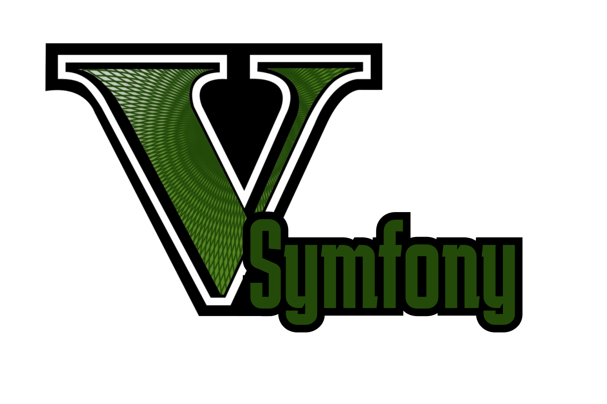

# Welcome to V Symfony project !
```markdown
    Your favorite Symfony 6 Application for Show Up your server roleplay
```

_________________

# Features

- [x] Steam Authentication
- [x] Discord Server Link
- [ ] Whitelist System
- [ ] Patch note System
- [ ] Rules System (or Wiki)
- [ ] Template System

## Usage for Steam Auth : 

1. Get your Steam API Key
2. Go to ```.env``` file and enter your key on ```STEAM_API_KEY```

## Usage for Discord Invitation Link

1. Find your Discord Invitation Link
2. Go to ```.env``` file and enter your key on ```DISCORD_SERVER_LINK```
3. Call ```DiscordService.php``` on your controller
4. Use Method 
    ```php
    $invitationLink = $discord->getDiscordInvitationLink();
    ```
5. Include the template ```_discord_button.html.twig``` in partials folder
    ```twig
    
    ```

## Usage for Discord Server Members Count

1. Create or Use your own Bot Discord
2. Invite to your Discord Server
3. Find your Bot Token on Developer Portal
4. Go to ```.env``` file and enter your key on ```DISCORD_BOT_TOKEN```
5. Call ```DiscordService.php``` on your controller
6. Use Method 
    ```php
    $discordUsers = $discord->getServerUserCount();
    ```